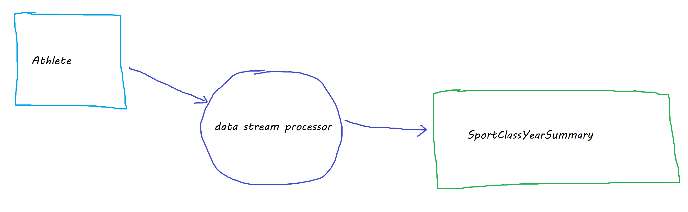

# FieldLevel Data Engineering Entry Level Position Take Home Project 

## Purpose

The goal of this project is to help us understand your data engineering abilities.  We do not expect you to spend more than a few hours completing the exercise.  There's no hard time limit so work on it at your convenience.  Take your time and submit a solution you feel proud of and ready to discuss with us.   Also, questions are definately welcome, so ask away.

## Objective

The objective of the exercise is to implement a data stream processor.  The application needs to process data changes from a data source (an OLTP database) and produce an updated transformed result.  The input set is constantly changing so your application needs to continueously recompute the transformation in near real time.  You can use any technology stack that can be built as a docker container (.net, python, etc)





## Setup

#### Get the project code
1. Import the exercise repository to your personal Github account. Using github's import tool (https://github.com/new/import) import this url: https://github.com/FieldLevel/fieldlevel-data-engineer-take-home/
1. Invite our github user "fl-codereview" to be a collaborator on your new repository
1. Get your new repository on your local machine

## Prerequisites

1. docker
1. development environment (e.g. Visual Studio, VS Code)


#### Run the programming environment
1. In a shell, navigate to your git repo
1. Create the docker environment.
```
> docker-compose up -d 
```
The docker compose will create the following containers.  Their purpose is described in more detail below.
* central-sql-db 
* data-activity-service
* eventlogs-db
* datalake 


## Requirements

The project requires you to consume changes from an input data set, perform a transformation of the data and write the output back to the same database.  The output should be produced in real-time (or near real-time) based on changes from the input data set.  

#### Transformation logic

The application should maintain a count of Athletes in each "Sport" and "Recruiting Class Year" .

Note that you are free to include any other publicly available technologies (e.g. Kafka, Redis, Ignite) into your solution if you so desire.  It isn't a requirement but whatever you decide, just be sure to package it up so it can be run in the same docker environment. 

The transformed output should be streamed to a table `SportClassYearSummary` on the SQL Server database `fl-central`.  


## Deliverables

 *  your application should be able to be run as a stand alone console application, or as a docker container.
 *  all source code should be able to be built in a Windows environment.
 *  include a database script with DDL for `SportClassYearSummary` as well as any other DDL you deem necessary.
 *  include any deployment instructions in a readme.md file.  These can include manual steps that need to be run first.
 *  invite our github user "fl-codereview" to be a collaborator on the repository
 *  create a pull request against your Github repository
 *  let us (your interview coordinator) know when you are ready to review


## Background

### central-sql-db.fl-central Database

The database `fl-central` is intended to simulate a typical production OLTP database.  
It is running inside a MSSQL docker container `central-sql-db`  

* rows can be inserted and modified, including the aggregate key columns
* an updated row is noted by a change in `modifiedDate` as well as in an incremented, unique sequence `latestOffset`
* each row represents a single `Athlete`.  The data is maintained by the application and can be altered by the Athlete and/or their team's coaching staff.

The SQL container is mapped to the host port 44331

#### Athlete 


```
    CREATE TABLE dbo.Athlete(
        athleteId int NOT NULL identity(1,1) ,
        athleteFirstName nvarchar(100) not null ,
        athleteMiddleName nvarchar(100) null ,
        athleteLastName nvarchar(100) not null , 
        sport nvarchar(50) not null ,
        gender char(1) not null ,
        recruitingClassYear smallint NULL,
        enrollmentAcademicLevel tinyint NULL,
        plannedCollegeMajor nvarchar(50) NULL,        
        height decimal(5, 2) NULL,
        weight decimal(5, 2) NULL,
        promotionalCoverLetter nvarchar(max) NULL,
        isMidYearTransfer bit NULL,
        highschoolGraduationYear int NULL,
        hobbiesAndInterests nvarchar(4000) NULL,
        satComposite nvarchar(10) NULL,
        satVerbal nvarchar(10) NULL,
        satMath nvarchar(10) NULL,
        satWriting nvarchar(10) NULL,
        actComposite nvarchar(10) NULL,
        scoutingNotes nvarchar(max) NULL,
        commitmentLevel tinyint NULL,
        recruitingNotes nvarchar(max) NULL,
        recommendedByUserId int NULL,
        gpa decimal(3, 2) NULL,
        latestOffset bigint not null ,
        createDate datetime2 not null ,
        modifiedDate datetime2 not null ,
        CONSTRAINT pk_Athlete PRIMARY KEY NONCLUSTERED (athleteId)  ,
        CONSTRAINT uq_Athlete UNIQUE CLUSTERED ( latestOffset)  
    ) 
```	


### data-activity-service

This container simulates the OLTP and event log activity in the docker-compose environment.  The service performs the following functions:
*  creates new athletes in `fl-central` via procedure `CreateNewAthlete`
*  modifies existing athletes in `fl-central` via a procedure `UpdateAthlete`
*  creates new event log messages in `fl-eventlogs` via procedure `CreateAthleteProfileViewEvent`


The service can be controlled by a table `testControl` in `fl-central`.  When the service is started, the default settings are:

**Athlete**

*  StartAthleteCount: 1000
*  AthleteInsertRatePerMin: 20
*  AthleteUpdateRatePerMin: 15
*  MaxAthleteCount: 300000

**AthleteProfileViewLog**

*  StartEventCount: 100
*  EventRatePerMin: 500
*  MaxEventCount: 200000000


```
CREATE TABLE dbo.testControl(
	     StartAthleteCount int not null 
        ,MaxAthleteCount int not null 
        ,AthleteInsertRatePerMin int not null 
        ,AthleteUpdateRatePerMin int not null
        ,StartEventCount int not null 
        ,MaxEventCount int not null 
        ,EventRatePerMin int not null 
        ,LatestOffset bigint not null PRIMARY KEY 
    ) 
```


##  Unused Services

** These services are not used and there existnace can be ignored **

### eventlogs-db.fl-eventlogs Database


The database `fl-eventlogs` is intended to simulate a event data store (e.g. Kafka, log files, etc).  
For simplicity, it is implemented inside a MSSQL docker container `eventlogs-db`  and the event data is written to a table `AthleteProfileViewLog`.

* data is insert only (no updates or deletes)
* each row represents a coach/recruiter (UserId) that has viewed an athlete's profile in the application.
* events are uniquely identified by a incrementing key `profileviewlogid`

The SQL container is mapped to the host port 44332

#### AthleteProfileViewLog 


```
 CREATE TABLE dbo.AthleteProfileViewLog(
	profileviewlogid bigint NOT NULL IDENTITY(1,1),
	userid int NULL,
	athleteid int NULL,
	dateutc datetime NULL,
	clientid uniqueidentifier NULL,
    CONSTRAINT pk_store_VideoInteractionLog PRIMARY KEY CLUSTERED (	profileviewlogid ) 
) 
GO
```	

### datalake Database

This is a PostgreSQL database.  The container is mapped to the PostgreSQL default port 5432 on the host.  


